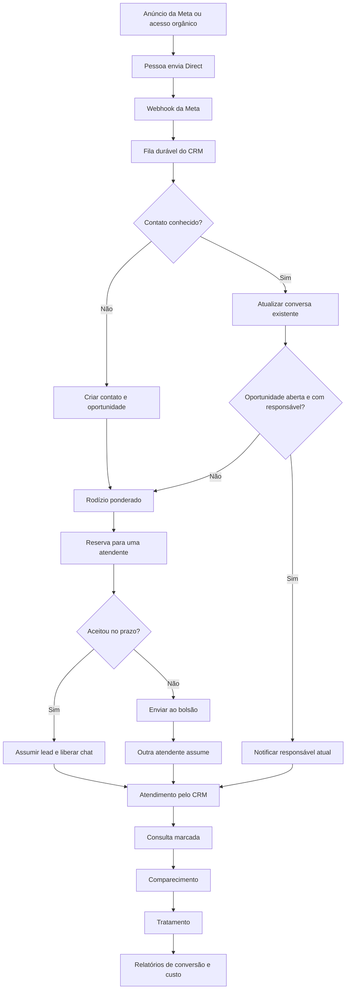

# Plano técnico — Instagram Direct, distribuição e atribuição Meta

## 1. Objetivo

Transformar o Direct do Instagram em um canal operacional do CRM, sem que as atendentes precisem compartilhar a senha da conta da empresa.

O fluxo final será:



## 2. Resultado esperado

- Todas as novas mensagens elegíveis do Instagram profissional aparecem no CRM.
- O CRM identifica se o remetente já existe usando o ID do Instagram fornecido pela Meta, e não apenas telefone.
- Um novo remetente cria contato, conversa e oportunidade apenas uma vez.
- A distribuição continua usando o rodízio ponderado já existente.
- A atendente só responde depois de aceitar/assumir o lead.
- Mensagens recebidas posteriormente voltam para a responsável atual, sem redistribuição indevida.
- Gestores conseguem visualizar, transferir e auditar conversas.
- O CRM registra a origem orgânica ou, quando houver evidência da Meta, o anúncio, conjunto e campanha.
- A Marketing API fornece gastos e desempenho para calcular CPL e custos por etapa do funil.
- As atendentes deixam de usar a senha compartilhada do Instagram após a homologação.

## 3. Limites importantes da Meta

### 3.1 Duas integrações diferentes

O projeto depende de duas autorizações independentes:

1. **Instagram Messaging API**: recebe e envia Directs. Usa, no mínimo, `instagram_business_basic` e `instagram_business_manage_messages`.
2. **Meta Marketing API**: lê campanhas, anúncios, resultados e gastos. Usa `ads_read`.

O token do Instagram não lê os dados dos anúncios. O token da Marketing API não substitui o token usado nas conversas.

### 3.2 Quem pode receber resposta

O CRM não poderá iniciar uma conversa comercial arbitrariamente. Primeiro o usuário precisa enviar uma mensagem ao Instagram profissional. O webhook dessa mensagem traz o identificador necessário para a resposta, chamado neste plano de `IGSID`.

### 3.3 Atribuição individual não pode ser presumida

O vínculo exato `lead -> anúncio` só será gravado quando o evento recebido trouxer uma evidência confiável de anúncio ou referência equivalente. Gastos agregados da Marketing API, sozinhos, não provam de qual anúncio veio uma pessoa.

Assim:

- Direct orgânico: `Instagram orgânico`;
- Direct com referência válida de anúncio: campanha, conjunto e anúncio são enriquecidos pela Marketing API;
- Direct sem atribuição de anúncio: `Instagram — origem orgânica`;
- o CRM nunca inferirá uma campanha apenas por horário, volume ou nome.

A primeira fase inclui um anúncio real de baixo orçamento, direcionado ao Direct, para confirmar exatamente quais dados de referência a Meta entrega hoje nesse tipo de campanha.

## 4. Arquitetura proposta

```text
Instagram profissional
        │
        │ webhook assinado
        ▼
GET/POST /webhooks/instagram
        │
        ▼
instagram_webhook_inbox (persistência + deduplicação)
        │
        ▼
worker com lease, tentativas e backoff
        │
        ├── identidade Instagram/contact
        ├── conversa/mensagens
        ├── oportunidade/atribuição
        ├── distribuição ponderada
        └── notificação da equipe

Atendente no CRM
        │
        │ POST de mensagem, com autorização e idempotência
        ▼
Instagram Send API

Meta Marketing API
        │ sincronização incremental
        ▼
insights diários por conta/campanha/conjunto/anúncio
        │
        ▼
relatórios de aquisição + funil do CRM
```

O webhook deve confirmar rapidamente o recebimento depois que o evento for salvo. Identificação, distribuição e demais regras rodam no worker. Isso evita perder mensagens quando a aplicação reiniciar ou a Meta repetir uma entrega.

O padrão existente em `backend/src/whatsapp.ts` será generalizado: verificação da assinatura, caixa de entrada durável, deduplicação, lease, retentativas e estado operacional.

## 5. Modelo de dados

O projeto hoje é centrado em telefone. Para Instagram, telefone pode não existir. A mudança deve ser feita sem quebrar os leads antigos.

### 5.1 `channel_accounts`

Representa a conta profissional conectada ao CRM.

- `id`
- `provider`: `instagram`
- `external_account_id`: ID da conta profissional
- `username`
- `status`: `active`, `token_expiring`, `disconnected`, `error`
- `graph_api_version`
- `token_reference` ou credencial criptografada
- `token_expires_at`
- `webhook_subscribed_at`
- `created_at`, `updated_at`

Para o teste de conta única, o token pode ficar somente em variável de ambiente. Se o CRM conectar várias empresas, as credenciais deverão ser armazenadas criptografadas, usando uma chave mestra fora do banco.

### 5.2 `contact_identities`

Desacopla a pessoa do canal pelo qual ela chegou.

- `id`
- `contact_id`
- `provider`: `instagram`, futuramente `whatsapp`, etc.
- `channel_account_id`
- `external_user_id`: IGSID recebido pela Meta
- `username` e `display_name`, quando disponibilizados
- `last_seen_at`
- unicidade em `(channel_account_id, external_user_id)`

O campo `contacts.phone` passará a ser opcional. No PostgreSQL será usado índice único parcial para telefones preenchidos; no MongoDB, índice único parcial equivalente. Quando a pessoa informar o telefone, o CRM poderá ligar ou mesclar as identidades com auditoria e tratamento de conflitos.

### 5.3 `conversations`

- `id`
- `channel_account_id`
- `contact_id`
- `opportunity_id`
- `external_conversation_id`, se fornecido
- `status`: `open`, `closed`, `blocked`
- `owner_user_id`
- `last_message_at`, `last_inbound_at`, `last_outbound_at`
- `reply_allowed_until`, quando aplicável à política vigente da Meta
- `unread_count`
- `created_at`, `updated_at`

### 5.4 `messages`

- `id`
- `conversation_id`
- `external_message_id`, único quando fornecido
- `client_request_id`, único para idempotência do envio
- `direction`: `inbound` ou `outbound`
- `sender_external_id` e `sender_user_id`
- `type`: `text`, `image`, `video`, `audio`, `story_reply`, `share`, `unsupported`
- `text`
- metadados permitidos de anexos, sem expor URL sensível em logs
- `status`: `received`, `queued`, `sending`, `sent`, `delivered`, `read`, `failed`, `unknown`
- `error_code` sanitizado
- `sent_at`, `delivered_at`, `read_at`, `created_at`

As mensagens são append-only. Correções operacionais não alteram silenciosamente o histórico.

### 5.5 `conversation_reads`

Mantém o estado de leitura por usuário do CRM sem depender apenas de um contador global.

- `conversation_id`
- `user_id`
- `last_read_message_id`
- `read_at`

### 5.6 `instagram_webhook_inbox`

- chave única do evento/mensagem
- ID da conta de destino
- payload mínimo necessário, protegido
- horário recebido e processado
- tentativas, lease, próxima tentativa e erro sanitizado

O payload bruto não deve ser guardado indefinidamente. Após o processamento, deve ser removido ou expirar por TTL configurável, mantendo apenas os dados normalizados e as evidências estritamente necessárias.

### 5.7 Atribuição e mídia paga

`lead_attributions` será generalizada para aceitar `instagram` e separar:

- evidência original imutável;
- tipo/força da evidência;
- conta de anúncio;
- `campaign_id`, `adset_id`, `ad_id`;
- nomes enriquecidos posteriormente;
- referência de origem;
- estado `attributed`, `organic`, `unattributed`, `enrichment_pending`, `enrichment_failed`.

Novas estruturas:

- `marketing_accounts`: conta, moeda, fuso, status de autorização e última sincronização;
- `marketing_daily_insights`: data, conta, campanha, conjunto, anúncio, moeda, gasto, impressões, alcance, cliques e ações relevantes retornadas pela Meta;
- unicidade por `(date, account_id, campaign_id, adset_id, ad_id)`.

As estruturas terão implementação equivalente em PostgreSQL/PGlite e MongoDB, pois o projeto atualmente usa MongoDB em produção e PGlite/PostgreSQL nos testes e ambientes locais.

## 6. Entrada de mensagens pelo webhook

### 6.1 Verificação

- `GET /webhooks/instagram` valida `hub.mode`, o verify token e devolve `hub.challenge`.
- `POST /webhooks/instagram` lê o corpo bruto e valida `X-Hub-Signature-256` com o App Secret.
- Comparações de segredo devem ser feitas em tempo constante.
- O tamanho máximo do corpo e o rate limit específico do endpoint devem ser configurados.
- Apenas eventos destinados à conta profissional cadastrada são processados.

### 6.2 Processamento

1. Validar assinatura e formato básico.
2. Desmembrar lotes em eventos individuais.
3. Gerar chave idempotente usando o ID externo da mensagem/evento.
4. Persistir na inbox antes de responder `200`.
5. O worker normaliza mensagem, identidade e evidência de origem.
6. Criar ou localizar contato, conversa e oportunidade.
7. Aplicar a regra de distribuição.
8. Notificar a atendente correta.

Eventos repetidos, fora de ordem, ecos de mensagens enviadas pelo próprio CRM e confirmações de leitura não podem criar novos leads.

Os campos usados pelo CRM são `messages`, `messaging_referral` e `messaging_postbacks`.
Reações e confirmações de leitura podem ser adicionadas quando houver necessidade de
exibi-las. Referral sem interação fica pendente e não cria lead sozinho.

## 7. Regras de identificação e distribuição

### Primeiro contato

- Um IGSID ainda não conhecido cria contato sem telefone.
- Cria conversa e oportunidade.
- A origem é classificada como orgânica ou anúncio confirmado.
- A oportunidade entra no rodízio ponderado atual.
- A reserva mantém o prazo já configurado no CRM.

### Enquanto estiver reservada

- Novas mensagens são anexadas à mesma conversa.
- Não é criado outro lead e o prazo não deve ser renovado indefinidamente por novas mensagens.
- A atendente reservada recebe aviso, mas o envio de resposta só é liberado após o aceite.

### Após o aceite

- A oportunidade e a conversa ficam vinculadas à responsável.
- Somente a responsável pode responder.
- O gestor pode ver, auditar e transferir; para responder como atendente, deve assumir ou transferir explicitamente.

### Reserva expirada

- A oportunidade vai para o bolsão usando a regra já existente.
- A primeira atendente elegível que assumir recebe a propriedade da conversa.
- A operação continua protegida contra dois aceites simultâneos.

### Contato recorrente

- Se existe oportunidade aberta com responsável, a mensagem volta diretamente para essa responsável.
- Se existe oportunidade fechada, aplica-se a política atual de retorno com revisão gerencial, evitando reabrir ou redistribuir silenciosamente.
- A conversa permanece registrada, mas o envio é bloqueado até a nova responsabilidade ser definida.

### Privacidade interna

- Atendentes não visualizam conversas de outras responsáveis.
- No bolsão, aparece apenas o resumo mínimo necessário para decidir assumir.
- O histórico completo é liberado ao vencedor do aceite.
- Gestores têm visão de auditoria conforme a regra atual de acesso.

## 8. Envio de mensagens pelo CRM

Endpoint interno proposto:

`POST /api/v1/conversations/:id/messages`

Fluxo:

1. Validar sessão, papel e propriedade da oportunidade.
2. Validar estado da conversa e janela/política de resposta vigente.
3. Exigir `Idempotency-Key` ou gerar `client_request_id` único.
4. Salvar a intenção de envio como `queued`.
5. Chamar `POST https://graph.instagram.com/{versão}/{ig-account-id}/messages` com `recipient.id = IGSID`.
6. Gravar o ID retornado pela Meta e mudar para `sent`.
7. Reconciliar estados posteriores por webhook, quando disponíveis.

Uma falha anterior à chamada pode ser tentada novamente. Em timeout após o POST, o estado fica `unknown` e é reconciliado antes de qualquer nova tentativa automática, para evitar mensagens duplicadas.

A primeira versão deve suportar texto e exibir anexos recebidos que forem oficialmente suportados. Envio de mídia, respostas rápidas e recursos avançados entram somente depois que texto estiver estável.

## 9. APIs internas do CRM

### Conversas

- `GET /api/v1/conversations?view=mine|reserved|pool&cursor=...`
- `GET /api/v1/conversations/:id/messages?cursor=...`
- `POST /api/v1/conversations/:id/messages`
- `POST /api/v1/conversations/:id/read`
- `POST /api/v1/conversations/:id/claim`
- `POST /api/v1/conversations/:id/transfer`

As ações de claim/transfer devem reutilizar a oportunidade como fonte de verdade, evitando dois estados independentes entre chat e distribuição.

### Integração

- `GET /api/v1/instagram/status`
- `POST /api/v1/integrations/instagram/connect` e callback OAuth, na versão multiempresa
- `DELETE /api/v1/integrations/instagram/:id`
- `POST /api/v1/meta-ads/sync`, restrito a gestor e usado principalmente para diagnóstico
- sincronização normal por job agendado

### Relatórios

- ampliar `GET /api/v1/reports/overview` ou criar `GET /api/v1/reports/acquisition`;
- filtros por período, canal, campanha, conjunto, anúncio, atendente e unidade;
- paginação e exportação posteriormente, sem carregar toda a base em memória.

## 10. Caixa de entrada no frontend

Será adicionada uma área `Conversas`/`Caixa de entrada` com:

- lista de conversas reservadas, próprias e disponíveis no bolsão;
- indicador de não lidas;
- nome/identidade do contato, canal, origem e responsável;
- histórico paginado;
- compositor de mensagem;
- estado claro quando ainda é necessário aceitar o lead;
- ações de aceitar, transferir, marcar consulta e atualizar funil;
- painel lateral com dados do lead e atribuição;
- mensagens de erro específicas para token expirado, janela fechada, rate limit e formato não suportado.

No celular, lista, chat e detalhes serão telas empilhadas. No desktop, podem ser três painéis.

Na primeira versão, a atualização pode usar o polling de poucos segundos já adotado no CRM, acompanhado de Web Push para reservas e novas mensagens. SSE/WebSocket fica como evolução quando o volume ou a exigência de tempo real justificar a infraestrutura adicional.

## 11. Atribuição, custos e relatórios

### 11.1 Enriquecimento do lead

Quando o webhook trouxer uma referência confiável de anúncio:

1. salvar imediatamente os IDs/evidência disponíveis;
2. criar o lead mesmo que a Marketing API esteja temporariamente indisponível;
3. enfileirar enriquecimento do anúncio;
4. consultar campanha, conjunto, anúncio e conta;
5. atualizar somente os campos enriquecidos, preservando a evidência original.

O atendimento nunca ficará bloqueado por falha nos relatórios.

### 11.2 Sincronização de desempenho

- sincronização diária por anúncio, com `time_increment=1` ou equivalente da versão usada;
- janela móvel de correção para absorver ajustes tardios da Meta;
- paginação, rate limit e backoff;
- moeda e fuso armazenados por conta;
- coleta mínima: gasto, impressões, alcance, cliques e ações relevantes à conversa, somente quando retornadas pela API;
- versão da API fixada por configuração, nunca `latest`.

### 11.3 Métricas

- leads de Instagram recebidos;
- orgânicos, atribuídos e não atribuídos;
- cobertura de atribuição = leads atribuídos / total de leads do Instagram;
- tempo até aceite;
- tempo real até a primeira resposta enviada;
- CPL atribuído = gasto dos anúncios / leads atribuídos aos mesmos anúncios;
- custo por consulta marcada;
- custo por comparecimento;
- custo por tratamento;
- conversão entre cada etapa;
- resultados por campanha, conjunto, anúncio, atendente e unidade.

O relatório deve exibir claramente o denominador. Não se deve misturar `início de conversa reportado pela Meta` com `lead identificado no CRM` sob o mesmo nome.

ROAS e receita ficam fora da primeira entrega, porque exigem um campo financeiro confiável para o tratamento fechado e regras para cancelamento, estorno e parcelamento.

## 12. Segurança, LGPD e operação

### Ação imediata

Os tokens exibidos durante os testes devem ser considerados expostos. Antes de homologação/produção:

- revogar e gerar novos tokens;
- nunca versionar `TOKENS.txt`;
- adicionar arquivos locais de segredo ao `.gitignore`;
- usar variáveis secretas no Render/ambiente;
- não enviar tokens por WhatsApp, prints ou logs.

### Controles do sistema

- validar HMAC de todo webhook;
- criptografar credenciais persistidas;
- mascarar tokens, texto de mensagens e dados pessoais nos logs;
- registrar auditoria de quem aceitou, transferiu, leu e enviou cada mensagem;
- rate limit nos endpoints internos e públicos;
- política configurável de retenção de mensagens e anexos;
- atender exclusão/exportação de dados e callback/instruções de exclusão exigidos pela Meta;
- backup e teste de restauração;
- não enviar informações clínicas, comparecimento ou tratamento de volta para a Meta por padrão;
- revisar com o responsável por LGPD a base legal, retenção e perfis de acesso.

Como o serviço atual está no plano gratuito do Render, a produção deverá usar instância sempre ativa. Um serviço que dorme pode atrasar webhook, worker, notificações e atendimento.

## 13. Variáveis de ambiente propostas

```text
META_GRAPH_VERSION=vXX.X

INSTAGRAM_ENABLED=true
INSTAGRAM_APP_ID=
INSTAGRAM_APP_SECRET=
INSTAGRAM_VERIFY_TOKEN=
INSTAGRAM_ACCOUNT_ID=
INSTAGRAM_ACCESS_TOKEN=

META_MARKETING_ENABLED=true
META_MARKETING_ACCESS_TOKEN=
META_AD_ACCOUNT_ID=act_...

# Necessário apenas se credenciais forem persistidas para múltiplas empresas
INTEGRATION_ENCRYPTION_KEY=
```

O verify token deve ser um segredo aleatório criado pela aplicação; ele não é o access token do Instagram.

## 14. Configuração e aprovação da Meta

### Durante o desenvolvimento

- manter o app em modo de desenvolvimento;
- usar apenas contas e pessoas com função no app;
- configurar callback e verify token;
- assinar os campos de webhook realmente usados;
- testar entrada, resposta e erros com `fulljob.br`;
- testar a Marketing API com uma conta de anúncios autorizada;
- criar um anúncio de baixo orçamento para Direct e validar a evidência de origem real.

### Antes da produção

- domínio e URLs de redirecionamento OAuth;
- política de privacidade pública;
- instruções ou callback de exclusão de dados;
- e-mail de contato, ícone, categoria e dados do app;
- verificação empresarial;
- solicitação de acesso avançado para `instagram_business_basic` e `instagram_business_manage_messages`;
- solicitar `instagram_business_manage_comments` somente se comentários entrarem no escopo;
- acesso adequado a `ads_read`/Marketing API para contas de clientes;
- vídeo de revisão mostrando login, mensagem recebida, distribuição, resposta no CRM e exclusão de dados;
- credenciais e roteiro estável para o revisor;
- publicação do app somente depois da homologação.

Sem acesso avançado, o fluxo funciona em desenvolvimento apenas com administradores, desenvolvedores e testadores autorizados. Para conectar o Instagram real de um cliente que não faz parte dessas funções e operar em produção, a aprovação da Meta é obrigatória.

## 15. Observabilidade

O painel técnico da integração deverá mostrar:

- conta conectada e versão da API;
- validade aproximada/estado do token;
- último webhook recebido e processado;
- idade do evento pendente mais antigo;
- eventos pendentes, em retentativa e falhos;
- última mensagem enviada com sucesso;
- última sincronização da Marketing API;
- atraso dos dados de anúncios;
- percentual de leads atribuídos;
- erros recentes por código, sem conteúdo sensível.

Alertas mínimos:

- token próximo do vencimento ou inválido;
- fila parada/acumulada;
- falhas contínuas de assinatura;
- falhas de envio acima do limite;
- sincronização de anúncios atrasada;
- rate limit da Meta.

## 16. Plano de testes

### Backend

- verificação GET válida e inválida;
- HMAC válido, inválido e corpo alterado;
- lotes com múltiplas mensagens;
- evento duplicado e fora de ordem;
- eco de saída, leitura, reação e tipo não suportado;
- primeiro IGSID cria apenas um contato/oportunidade;
- mensagens seguintes preservam responsável;
- reserva expira e vai ao bolsão;
- corrida de dois aceites;
- envio bloqueado antes do aceite ou por atendente incorreta;
- idempotência e timeout ambíguo no envio;
- origem orgânica, anúncio confirmado e não atribuída;
- paginação, rate limit e correção incremental dos insights;
- diferenças de moeda/fuso;
- deleção de lead também remove/redige conversa conforme a política.

### Frontend/E2E

- nova mensagem aparece na caixa de entrada;
- aceitar libera o compositor;
- outro usuário não vê nem responde a conversa;
- transferência altera acesso imediatamente;
- chat funciona em desktop e celular;
- marcar consulta e avançar funil mantém a conversa vinculada;
- relatórios distinguem atribuído, orgânico e não atribuído;
- erros da Meta têm mensagem compreensível e ação recomendada.

### Homologação real

- Direct de seguidor;
- Direct de não seguidor/pedido de contato;
- resposta a story e compartilhamento, se suportados;
- anúncio real de clique para Instagram Direct;
- reinício do servidor com evento pendente;
- token revogado e reconectado;
- app em modo desenvolvimento e depois modo publicado.

## 17. Fases de implementação

### Fase 0 — segurança e preparação

- revogar tokens expostos;
- proteger arquivos e variáveis de segredo;
- escolher versão fixa da Graph API;
- mover produção para serviço sempre ativo;
- definir retenção e acesso com o cliente.

**Aceite:** nenhum segredo no Git/logs e ambiente apto a receber webhooks continuamente.

### Fase 1 — prova técnica com Full Job

- implementar callback mínimo;
- receber e inspecionar de forma segura o payload real do Direct de teste;
- capturar IGSID;
- responder pelo Send API;
- testar anúncio real de baixo orçamento e verificar referência de anúncio;
- documentar os campos realmente recebidos.

**Aceite:** mensagem pessoal chega ao backend e recebe resposta via API; fica determinado, com evidência, o nível de atribuição possível.

### Fase 2 — núcleo multicanal

- migrations e índices Mongo;
- contato sem telefone e identidade por canal;
- conversa, mensagens, inbox e outbox;
- generalizar atribuição e deleção;
- adaptar o ingest sem quebrar WhatsApp/manual.

**Aceite:** testes de identidade, deduplicação e compatibilidade passam nos dois bancos.

### Fase 3 — webhook e envio de produção

- HMAC, inbox durável, worker, retry e observabilidade;
- normalização dos eventos;
- Send API com autorização e idempotência;
- estados de envio e erros operacionais.

**Aceite:** reinícios e redeliveries não perdem nem duplicam leads/mensagens.

### Fase 4 — caixa de entrada e distribuição

- telas de conversa;
- integração com reserva, aceite, bolsão e transferência;
- restrições de acesso;
- notificações e estados não lidos;
- ações de funil dentro do atendimento.

**Aceite:** quatro atendentes conseguem operar simultaneamente sem usar a senha do Instagram e sem acessar conversas alheias.

### Fase 5 — Marketing API e relatórios

- sincronização de contas, campanhas, conjuntos, anúncios e insights;
- enriquecimento de atribuição;
- indicadores de gasto, CPL e custo por etapa;
- cobertura e fila de não atribuídos.

**Aceite:** os totais batem com o Gerenciador dentro da tolerância/defasagem documentada e cada métrica informa sua origem e denominador.

### Fase 6 — revisão da Meta e piloto Artisti

- materiais de App Review e acesso avançado;
- conexão da conta real da Artisti;
- piloto controlado com tráfego reduzido;
- operação paralela e plano de retorno temporário ao Instagram;
- retirada gradual da senha compartilhada após estabilidade.

**Aceite:** operação publicada, monitorada, aprovada pela Meta e validada pela equipe do cliente.

## 18. Estimativa de ordem de grandeza

Para um desenvolvedor familiarizado com o projeto:

- prova técnica: 2 a 4 dias úteis;
- núcleo multicanal e backend: 7 a 11 dias úteis;
- caixa de entrada e distribuição: 6 a 10 dias úteis;
- Marketing API e relatórios: 5 a 8 dias úteis;
- segurança, testes, homologação e ajustes: 5 a 8 dias úteis.

Total técnico estimado: **25 a 41 dias úteis**, executado por etapas. A análise da Meta é externa e pode acrescentar um prazo imprevisível; por isso ela não deve entrar como uma data garantida de desenvolvimento.

## 19. Mapa inicial de alterações no repositório

### Backend

- novos módulos: `instagram.ts`, `messaging.ts`, `meta-marketing.ts` e respectivos stores;
- alterar `crm.ts`, `mongo-crm.ts` e `types.ts` para identidade multicanal;
- alterar `app.ts` e `server.ts` para rotas/configurações;
- alterar `reports.ts` para aquisição e primeira resposta real;
- alterar `lead-deletion.ts` para conversas e mensagens;
- novas migrations após `012_compact_queue_positions.sql`;
- novos índices/coleções em `mongo-store.ts`;
- testes específicos de Instagram, mensageria e Marketing API.

### Frontend

- nova página/rota de caixa de entrada;
- componentes de lista, thread, compositor e detalhes;
- atualizar `api.ts` para canais e atribuições diferentes de WhatsApp;
- integrar navegação, detalhes do lead, transferência e relatórios;
- testes E2E desktop/mobile.

### Infraestrutura e documentação

- atualizar `backend/.env.example`, `render.yaml`, README e documentação de deploy;
- adicionar health/status e alertas;
- incluir política de rotação de tokens, App Review e runbook de incidentes.

## 20. Riscos e decisões pendentes

1. **Atribuição por anúncio:** precisa ser provada com um anúncio real no Direct antes de prometer rastreio individual completo.
2. **Aprovação da Meta:** pode exigir ajustes ou nova gravação de revisão.
3. **Expiração de token:** requer monitoramento e reconexão segura.
4. **Janela e recursos de mensageria:** variam conforme a política/versão da Meta; o CRM deve bloquear ações não permitidas.
5. **Mensagens fora do CRM:** enquanto alguém ainda responder diretamente no Instagram, o histórico pode ficar inconsistente; a operação precisa de uma regra única após o piloto.
6. **Conteúdo sensível:** Directs podem conter dados de saúde; retenção, acesso e logs precisam ser aprovados sob LGPD.
7. **Infraestrutura gratuita:** suspensão do serviço é incompatível com atendimento confiável.
8. **Volume futuro:** o worker durável suporta crescimento inicial; múltiplas instâncias exigirão manter leases atômicos e, para tempo real, pub/sub.

## 21. Referências oficiais

- Instagram Send API: https://www.postman.com/meta/instagram/folder/uxudqu0/send-api
- Instagram API com Instagram Login: https://www.postman.com/meta/instagram/documentation/6yqw8pt/instagram-api
- Meta Marketing API: https://www.postman.com/meta/facebook-marketing-api/overview
- Insights API: https://www.postman.com/meta/facebook-marketing-api/folder/zzd6d5p/insights-api
