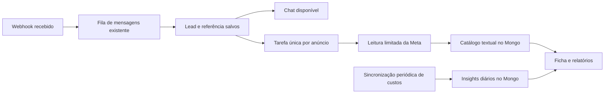

# Plano técnico — origem dos anúncios e métricas do funil

Data: 04/10/2026. Estado: implementação local do núcleo; ativação e homologação na conta real pendentes.

## Escopo implementado

O código já inclui aquisição inicial imutável, catálogo textual por anúncio, versões de conteúdo, processamento recuperável com orçamento persistido, Insights diários com cobertura e custos restritos ao destino Instagram Direct, ficha textual e relatório com funil e lista paginada. Há implementações equivalentes para MongoDB e SQL. A orientação de ativação está em [INSTAGRAM.md](INSTAGRAM.md#marketing-api-e-métricas).

Por decisão posterior do usuário, entradas do Instagram sem referência paga serão chamadas **Orgânica**. Essa é uma classificação operacional, não prova técnica de ausência de anúncio. Não reclassificar Indicação ou outra origem manual.

O restante deste documento preserva também propostas de evolução, não uma lista de funcionalidades já entregues. Ainda não estão implementados agrupamento histórico por publicação, vínculo de cada interação a uma versão de criativo, continuação do histórico de referências além das 20 recentes na interface e redução adaptativa das janelas após atingir o limite de volume. Não houve consulta à conta real nem aferição de carga no plano do Render. Nomes e links exibidos são do catálogo consultado na data indicada, não prova da versão vista por uma pessoa. O histórico legado é conservador: não reconstruir aquisição paga a partir de uma interação posterior.

## 1. Resultado esperado e escopo

Identificar, na ficha do lead, o anúncio que originou a entrada e a publicação do Instagram vinculada quando houver evidência suficiente. Nos relatórios, cruzar esse vínculo com investimento, agendamento, comparecimento e venda registrada no CRM.

Esta etapa considera uma clínica, uma conta de anúncios configurada e o Instagram Direct já integrado. Anúncios para WhatsApp, formulários, site ou vários destinos terão investimento separado até existir uma medição compatível para esses destinos. O relatório não deve atribuir todo o investimento da conta exclusivamente aos leads do Instagram.

Decisões:

- Exibir nomes e, quando disponível, link da publicação. Não criar miniaturas, embeds ou download de mídia para esta funcionalidade.
- Armazenar apenas identificadores, textos limitados, links, datas, estados e métricas numéricas no mesmo MongoDB.
- Reaproveitar Node/Render, a integração de mensagens e o módulo de Marketing API existentes. Não adicionar Redis, outro banco ou servidor de processamento.
- Marketing API somente para leitura. Nenhuma alteração de campanhas e nenhum envio de conversas, dados clínicos ou eventos comerciais à Meta nesta etapa.
- Manter distribuição, reservas de prospecção, comentários, propriedade dos leads e funcionamento do chat independentes do enriquecimento de anúncios.
- Priorizar a identificação do anúncio antes de liberar os novos indicadores financeiros.

## 2. Base existente e ajustes necessários

| Área | Situação observada | Trabalho previsto |
| --- | --- | --- |
| `backend/src/instagram.ts` | Normaliza referências de anúncios e guarda referências recebidas antes da mensagem por até 24 horas | Preservar contexto da conta, tempo do evento e evidência de associação; tratar chegada fora de ordem |
| `backend/src/crm.ts` e `backend/src/mongo-crm.ts` | Salvam `lead_attributions` em novas entradas e em retornos de contatos existentes | Materializar a origem inicial sem confundir retorno por anúncio com aquisição |
| `backend/src/meta-marketing.ts` | Consulta Insights diários, sincroniza sete dias a cada 30 minutos e guarda resultados | Adicionar catálogo textual de anúncios, tarefas recuperáveis, controle de uso e cálculos corretos |
| `backend/src/mongo-store.ts` | Índices existentes e transação de domínio com trava global da distribuição | Criar índices específicos; evitar essa trava nas gravações analíticas |
| `frontend/src/forms.tsx` | Mostra referências brutas do anúncio na ficha | Exibir nomes resolvidos, publicação disponível e estado de identificação |
| `frontend/src/manager-reports.tsx` | Relatório Meta Ads por campanha | Acrescentar nível anúncio/publicação e resultados comerciais |
| `backend/src/operations.ts`, `backend/src/types.ts` | Venda, valor em centavos, contrato e comparecimento já possuem campos | Reutilizar os campos com definições de métricas explícitas |

Correções identificadas no código atual:

1. Preservar “Instagram — origem orgânica” nas entradas sem referência de anúncio e exibir “Orgânica” no novo bloco, conforme decisão do usuário. A ausência de evidência paga não comprova ausência de publicidade.
2. O relatório seleciona a primeira referência paga encontrada, mesmo que ela tenha ocorrido depois da aquisição do lead. Separar origem inicial de interações posteriores.
3. O investimento de todos os anúncios consultados pode ser dividido apenas pelos leads identificados do Instagram. Definir e aplicar o mesmo conjunto de anúncios ao numerador e ao denominador.
4. O alcance é somado entre dias e anúncios. Retirar essa soma; alcance único não será um indicador desta entrega.
5. A associação de nomes depende de haver Insights do anúncio no período consultado. O catálogo de anúncios precisa ser independente do período e da existência de gasto.
6. O período do relatório usa São Paulo, enquanto a consulta de anúncios aceita outro fuso. Utilizar o fuso validado da conta em toda a medição de aquisição/investimento.
7. A sincronização atual apaga e regrava o intervalo e usa `MongoStore.atomic`, que também atualiza a trava da distribuição. As transações analíticas devem ser independentes e escrever somente as alterações necessárias.
8. `sale_completed_at` também foi preenchido por uma migração histórica para contratos pendentes. Sua presença isolada não comprova uma venda válida nem sua data real.

## 3. Identificação correta do anúncio e da publicação

O vínculo é feito por ID, nunca pelo nome do anúncio, pelo nome do lead ou por semelhança de texto. O SDK oficial expõe os identificadores da campanha, conjunto e criativo no anúncio. [Referência oficial de Ad](https://github.com/facebook/facebook-python-business-sdk/blob/main/facebook_business/adobjects/ad.py)

Ordem de enriquecimento:

1. Receber uma referência explícita de anúncio no webhook autenticado.
2. Registrar `ad_id`, evento de origem, conta do Instagram e oportunidade correspondente.
3. Procurar o anúncio no catálogo local.
4. Se estiver ausente ou vencido, criar uma tarefa única para consultar a conta de anúncios autorizada.
5. Validar que o anúncio pertence à conta configurada e guardar campanha, conjunto e nome do anúncio.
6. Consultar somente os campos textuais necessários do criativo para obter a publicação vinculada, se disponível.

Validar os formatos de referência já tratados (`ad_id`, `ads_context_data.ad_id` e `source_id` acompanhado de evidência explícita de anúncio) com fixtures do webhook. Um `source_id` genérico não será promovido a anúncio sem essa evidência. O vínculo automático não poderá depender de um único formato de evento se a integração receber outras variantes válidas.

Campos candidatos do criativo: `id`, `name`, `title`, `body`, `effective_instagram_media_id`, `source_instagram_media_id`, `instagram_permalink_url` e `effective_object_story_id`. A disponibilidade deve ser validada na versão da API e no token usados pelo cliente; campos opcionais não podem impedir a identificação básica do anúncio. [Referência oficial de AdCreative](https://github.com/facebook/facebook-python-business-sdk/blob/main/facebook_business/adobjects/adcreative.py)

O nome do anúncio é o nome cadastrado no Gerenciador de Anúncios. Ele não deve ser apresentado como se fosse necessariamente o título de um post. A interface usará:

- **Anúncio:** nome do anúncio; na falta dele, título recebido no evento; por último, “Anúncio ID …”.
- **Publicação:** link/ID validado da publicação quando resolvido; um texto curto de referência pode complementar, sem afirmar que é um título oficial.
- **Publicação não identificada:** quando o anúncio foi identificado, mas não há associação inequívoca a um post.

Se houver múltiplos criativos/publicações possíveis, manter a atribuição no nível do anúncio. Não escolher arbitrariamente um post nem afirmar qual variação uma pessoa viu. Um anúncio com várias variantes continua útil para rastreamento mesmo sem um post único.

Consultas atuais também não comprovam qual criativo estava em circulação meses atrás. Guardar a data da consulta e distinguir metadados atuais de evidência presente no evento original.

## 4. Regras de atribuição e deduplicação

### Origem inicial

Acrescentar uma projeção pequena em `opportunities`, chamada `acquisition`, contendo:

- `kind`: `paid`, `organic` ou `manual`.
- `channel_account_id`, `occurred_at` e `time_basis` (`provider` ou `received`).
- `event_id`, `ad_id` e `rule_version`.
- Legados e oportunidades criadas pelo fluxo de comentários podem não ter essa projeção; isso não autoriza promover uma referência posterior a aquisição paga.

O primeiro evento que cria a oportunidade determina a origem inicial. Reservar um perfil não é prova de aquisição paga. Uma oportunidade criada por comentário ou indicação não deve virar aquisição paga quando receber um anúncio depois.

Uma referência recebida com atraso só poderá completar a origem inicial quando a correlação com aquela entrada for demonstrável. Proximidade de horário, sozinha, não basta. Guardar como interação paga posterior ou como origem inicial não resolvida quando a evidência for insuficiente.

Preservar três tempos quando disponíveis: tempo do evento informado pela Meta, recebimento no webhook e processamento no CRM. Não usar a hora do processamento como se fosse a hora original de uma mensagem atrasada.

### Histórico de interações

Manter `lead_attributions` como histórico, com os campos adicionais de conta, tempos, correlação e versão de metadados. As referências posteriores permanecem consultáveis e não substituem automaticamente a aquisição inicial.

Usar a identidade existente por conta/canal/ID do remetente para localizar o contato. Esta entrega não cria um segundo lead só porque chegou uma referência de anúncio e não altera o responsável.

Deduplicar por identificador estável do evento no contexto da conta e canal. Preservar a compatibilidade das chaves existentes durante a migração: uma repetição do mesmo webhook não pode criar outra atribuição, tarefa ou venda.

### Unidade de contagem

O relatório principal contará **oportunidades de aquisição**, identificadas por `opportunity_id`. O retorno do mesmo contato em outra oportunidade será identificado como retorno, não anunciado como nova pessoa. Nenhuma venda será contabilizada uma vez para cada mensagem ou para cada anúncio com que o lead interagiu.

## 5. Modelo de dados e índices

Preservar as coleções existentes. Acrescentar somente estruturas de metadados e execução, sem binários ou respostas completas da Graph API.

| Estrutura | Conteúdo e limite lógico | Índice principal |
| --- | --- | --- |
| `opportunities.acquisition` | Uma origem inicial por oportunidade; somente IDs, estado e tempos | Composto por conta, tipo de origem, data de aquisição e ID, conforme consulta |
| `lead_attributions` | Evidência por evento; referência à versão de metadados | Manter deduplicação; oportunidade + tempo; conta + anúncio para reconciliação |
| `meta_marketing_ads` — nova | Um catálogo por conta/anúncio; nomes, IDs, escopo de medição, versão atual e próxima consulta | Único `(account_id, ad_id)`; `(account_id, next_refresh_at)` |
| `meta_marketing_ad_versions` — nova | Snapshot textual imutável, criado somente quando o conteúdo relevante mudar | Único `(account_id, ad_id, content_hash)` |
| `meta_marketing_daily_insights` | Uma linha por conta/dia/anúncio; investimento e contagens | Manter único `(account_id, date_start, ad_id)`; adicionar `(account_id, ad_id, date_start)` se a consulta justificar |
| `meta_marketing_daily_coverage` — nova | Confirmação de consulta completa por conta/dia, inclusive dias sem gasto | Único `(account_id, date_start)` |
| `meta_marketing_jobs` — nova | Uma tarefa consolidada por anúncio ou janela de sincronização | Chave única da tarefa; `(account_id, state, next_attempt_at)` |
| `meta_marketing_sync_state` | Estado, revisão publicada, falha sanitizada e bloqueio temporário por conta | Manter único por conta |

Limites de persistência propostos: nomes até 500 caracteres, texto de referência até 1.000, links HTTPS até 2.048 e IDs com validação de formato. Não solicitar `image_url`, `thumbnail_url`, bytes de vídeo, preview HTML ou lista de arquivos neste enriquecimento.

Valores de venda já usam centavos. Para gastos recebidos como decimal, usar representação decimal exata ou unidade inteira de 1/1.000.000 da moeda, validando faixa segura; somar antes de arredondar para exibição. Não calcular dinheiro por sucessivas somas imprecisas de ponto flutuante. Valores ausentes não viram zero.

Versões não serão criadas por mudança de `checked_at` ou ordem de campos. O hash abrange apenas os campos relevantes e normalizados. O vínculo de uma atribuição a uma versão não muda porque o anúncio foi renomeado depois; a ficha pode informar o nome atual adicionalmente.

Os Insights diários manterão dimensões suficientes para preservar o histórico. Não será feita uma remoção destrutiva de campos antigos apenas para economizar alguns bytes. Reduzir payloads e arrays não utilizados nas novas escritas, mantendo compatibilidade de leitura.

Manter tarefas recorrentes consolidadas, em vez de criar um documento a cada tick. Recibos técnicos concluídos poderão expirar após 30 dias, desde que já não sejam necessários à retomada; pendências, leases, cooldowns e orçamentos ativos não terão essa expiração. Catálogo, referências de origem e métricas comerciais não terão exclusão automática nesta entrega. Medir volume de documentos e índices e registrar crescimento para decidir uma política histórica futura com dados reais.

Validar os índices com as consultas reais e `explain`, sem criar índices redundantes por precaução. Implementar migrações SQL equivalentes para o caminho PostgreSQL/PGlite que o projeto ainda mantém.

## 6. Recebimento e processamento recuperável



Salvar a tarefa de enriquecimento junto da atribuição na transação de ingresso, usando upsert pela chave estável. Não realizar chamadas externas dentro da transação. Uma queda depois do recebimento deixa uma tarefa pendente recuperável.

O processamento consulta o catálogo uma vez para vários leads do mesmo anúncio. O número de consultores e de aberturas de ficha não aumenta o número de consultas à Meta.

O worker deve operar com lease persistido por conta: token de posse, validade de dois minutos, renovação enquanto trabalha e verificação do token antes de publicar resultados. Somente um ciclo de marketing por conta executa por vez, inclusive durante sobreposição de instâncias em deploy. Uma instância antiga não pode publicar depois de perder o lease.

Usar prazo de execução por lote de até 90 segundos, com interrupção entre etapas. Salvar progresso entre anúncios e janelas de Insights concluídas. Se uma janela for interrompida no meio da paginação, descartar o conjunto incompleto e retomá-la do início: salvar apenas o cursor sem guardar as páginas anteriores perderia dados. Reduzir janelas grandes por dia após atingir limites; uma janela mínima ainda excessiva fica pendente com erro explícito. Se o lease expirar, o trabalho é retomado por outra execução sem perder o último conjunto válido de dados.

Erros da Marketing API mudam o estado do enriquecimento, não o estado da mensagem. O chat e a distribuição continuam funcionando com “Anúncio identificado; detalhes pendentes”.

## 7. Frequência, orçamento e proteção da API

Os valores abaixo são limites internos conservadores propostos, não cotas prometidas pela Meta.

| Operação | Frequência proposta |
| --- | --- |
| Anúncio novo recebido no webhook | Tarefa priorizada na próxima passagem, alvo de até um minuto com servidor ativo e API disponível |
| Nome/criativo de anúncio ativo já conhecido | No máximo uma atualização a cada 24 horas |
| Anúncio inativo conhecido | Sete dias; referência nova pode antecipar conforme cache e orçamento |
| Custo de hoje e ontem | A cada 60 minutos |
| Reconciliação dos últimos sete dias | Uma vez ao dia |
| Reconciliação dos últimos 31 dias | Uma vez por semana |
| Primeira carga | Últimos 31 dias, divididos em janelas pequenas e retomáveis |
| Atualização solicitada pela gestão | Agenda trabalho; intervalo mínimo de cinco minutos e respeito ao bloqueio da conta |

Controle de execução:

- Uma chamada de Marketing API em andamento por conta. No máximo 20 subconsultas por passagem e no máximo 120 por hora como teto interno inicial.
- Consultar novos anúncios em pequenos lotes quando a versão da API suportar; considerar cada operação do lote no orçamento interno. Lote não será tratado como acesso ilimitado.
- Pedir apenas campos necessários. Reaproveitar campanha/conjunto e referências já conhecidos. Não listar toda a biblioteca de mídia do Instagram.
- A consulta básica de nome/conta e a consulta opcional de publicação têm falhas isoladas. Campo opcional rejeitado permite uma única tentativa reduzida, cujo resultado de compatibilidade é lembrado por versão/configuração; não repetir indefinidamente uma consulta incompatível.
- Reaproveitar limites de resposta já existentes: até 500 registros por página, 20 páginas, 10.000 registros e 8 MiB de corpo acumulado por janela, com até 2 MiB por página.
- Limitar também a quantidade de objetos decodificados e medir memória real; bytes de rede não correspondem ao consumo completo de memória do Node.
- Timeout de 30 segundos por requisição, dentro do prazo total do lote.
- Recriar a próxima URL a partir de cursor validado e host fixo, mantendo a proteção existente contra URLs de paginação inesperadas.
- Ler sinais de uso/limitação e `Retry-After` quando presentes. Aproximação do limite suspende temporariamente novas chamadas de marketing; não há uma cota fixa universal a presumir.
- Para rede/5xx/limitação: tentativas com atrasos de 1, 5, 15 e 60 minutos, com pequena variação aleatória, nunca antes do prazo indicado pela Meta.
- Para token inválido ou permissão insuficiente: suspender tarefas dependentes e exibir ação necessária à gestão. Não repetir o mesmo erro a cada minuto.
- Para um objeto inacessível/removido: preservar dados já conhecidos, marcar indisponibilidade e aplicar cache negativo de 24 horas; repetir só após o prazo ou ação explícita respeitando orçamento.
- Após cinco falhas consecutivas de uma tarefa, encerrar o ciclo de tentativa rápida; retomar apenas após correção/reconciliação agendada, no máximo diariamente para erros transitórios persistentes.
- Priorizar referências novas e custos recentes; carga histórica cede espaço. Reiniciar o servidor não reinicia orçamento, cooldown ou progresso.

A próxima execução deve ser agendada pelo trabalho mais próximo. Evitar um loop de consulta ao Mongo a cada segundo quando não houver tarefas. Em plano gratuito suspenso do Render, esses tempos são metas a partir da retomada; não há garantia de execução com o processo desligado.

## 8. Gravações e consultas leves no Mongo/Render

Insights só são publicados quando todas as páginas da janela terminarem e forem validadas. Uma resposta incompleta não pode apagar dados anteriores nem transformar gasto desconhecido em zero.

Após baixar uma janela completa da conta, comparar o conteúdo normalizado com o armazenado. Fazer `bulkWrite` em lotes de até 500, atualizando somente linhas alteradas. Remover linhas obsoletas somente do intervalo comprovadamente completo e publicar a cobertura na mesma transação. Uma consulta filtrada de anúncios não pode marcar o dia como completo para a conta inteira.

Essa transação analítica deve usar sessão Mongo própria, sem alterar `distribution_settings.fence`. Ela mantém consistência entre dados, cobertura e revisão do relatório, mas não serializa marketing com aceite de lead ou transferência. SQL terá comportamento equivalente. Não reutilizar indevidamente a opção chamada `readOnly` para esconder uma transação de escrita.

Relatórios usam agregações no banco, projeção dos campos necessários e filtro de período antes de joins. Evitar carregar todos os contatos, mensagens, históricos ou attributions em arrays no Node. Agregar investimento separado das conversões e combinar por anúncio, impedindo multiplicação do gasto em joins de um anúncio com vários leads.

Limites iniciais:

- Período de até 31 dias, preservando o limite atual.
- Lista paginada com 50 linhas por página e cursor estável.
- Histórico de referências na ficha: dez itens iniciais, com continuação paginada.
- Orçamento de execução de consulta de até cinco segundos (`maxTimeMS`/equivalente SQL) e erros controlados; consultas complexas do relatório não bloqueiam o carregamento básico da ficha.
- Cache de relatórios por até cinco minutos, chaveado por conta, filtros, período, versão da regra e revisão dos dados; no máximo 20 entradas ou 4 MiB de resultados serializados, com remoção das menos usadas. Permissão validada antes de usá-lo.
- A revisão de aquisição/funil muda nas mutações relevantes; uma atualização de etapa ou venda invalida os resultados afetados, sem reprocessar todos os leads.
- Nenhum polling novo por conversa. Ficha e relatório leem o Mongo; não consultam a Graph API durante o GET.

Por exemplo, 20 anúncios com atividade diária durante 31 dias geram até 620 linhas diárias, independentemente de haver dez ou mil mensagens no chat. Dez aberturas da mesma ficha geram zero chamadas à Meta. O volume real, incluindo índices, deve ser medido antes de estimar duração do plano gratuito do Mongo.

## 9. Definições de métricas e período

### Escopo do investimento

Classificar cada anúncio como `instagram_direct`, `mixed`, `other` ou `unclassified`, usando metadados comprovados e, quando necessário, uma seleção explícita da gestão registrada no CRM. Guardar a procedência dessa classificação.

O conjunto elegível inclui todos os anúncios selecionados para aquela medição, inclusive os que não geraram lead. Não escolher somente anúncios com conversão, pois isso reduziria artificialmente o custo.

Mostrar investimento total da conta separado do investimento elegível. Anúncios mistos ou não classificados podem aparecer com seu gasto total, mas sem um CPL exclusivo do Instagram se não for possível separar o gasto daquele destino. Não dividir gasto por destino por palpite.

### Coorte de aquisição

Padrão: “Resultados atuais dos leads adquiridos entre X e Y”, com data/hora de atualização. Acompanhar agendamentos e vendas posteriores desses mesmos leads. Não restringir as vendas somente ao mês da entrada e não dividir investimento deste mês por vendas de leads de outro mês.

A janela selecionada usa o fuso da conta de anúncios, validado na conexão. Moeda vem da conta; não somar moedas diferentes. Indicadores de conversão relatados pela Meta, se exibidos futuramente, devem ser separados dos resultados do CRM e informar sua própria regra/janela de atribuição.

### Regras de contagem

| Indicador | Definição proposta |
| --- | --- |
| Leads atribuídos | Oportunidades com origem inicial paga verificada em anúncios elegíveis e aquisição no período; contagem distinta por oportunidade |
| Leads que agendaram | Oportunidades da coorte com ao menos uma consulta não cancelada, inclusive consultas já realizadas ou com falta; reagendar não duplica lead |
| Compareceram | Resultado válido mais recente de consulta igual a compareceu; considerar também comparecimento manual registrado na ficha quando aplicável |
| Não compareceram | Resultado válido mais recente igual a falta; não classificar ausência de informação como falta |
| Vendas registradas | Oportunidades atualmente fechadas com registro comercial válido; contrato pendente não conta como fechamento apenas por estar em `saleStages` |
| Contratos assinados | Subconjunto com `contract_status = signed`, exibido separadamente |
| Valor de vendas registradas | Soma de `total_value_cents` das vendas válidas; edição substitui o valor, não cria uma segunda venda |
| CPL atribuído | Investimento elegível dividido pelos leads atribuídos |
| Custo por etapa | Mesmo investimento dividido pela contagem distinta de leads daquela etapa |
| Retorno sobre vendas registradas | Valor das vendas atribuídas dividido pelo investimento elegível, com esse rótulo e sem alegar recebimento financeiro ou lucro |

Para venda válida, exigir etapa fechada e evidência comercial coerente (`sale.completed`/registro da nova rotina ou legado validável); separar registros históricos sem comprovação suficiente. Não presumir data real de venda a partir do preenchimento histórico de `sale_completed_at`. Valor ausente permanece “Não informado” e impede um retorno financeiro completo, mesmo que exista uma contagem válida de fechamentos.

Comparecimento manual pode existir sem agendamento. Por isso, os totais não precisam formar um funil estritamente decrescente; essa diferença deve ser interpretável. Não inferir venda de avaliação a partir do agendamento: o projeto não tem comprovação suficiente de pagamento de avaliação para essa métrica.

Cancelamentos, correções de comparecimento, reaberturas e alterações de valor são refletidos pelo estado comercial válido. Não somar cada evento de atualização como nova conversão. Historicamente, o relatório será uma visão atualizada da coorte, não uma reconstrução exata de “como estava naquele dia”.

Divisor zero resulta em `null`/“—”, nunca infinito. Período sem cobertura completa resulta em indicador parcial ou indisponível, não em zero silencioso. Exibir também quantos leads ficaram sem atribuição e quantos anúncios ficaram sem metadados/custos.

### Agrupamento por publicação

Um mesmo post pode estar associado a vários anúncios: somar uma única vez o gasto de cada anúncio/dia pertencente ao grupo e contar cada oportunidade uma vez conforme sua origem inicial. Nunca replicar todo o gasto do anúncio em cada ficha e somar essas fichas.

Se não houver post único comprovado, ou houver mudança histórica de criativo sem evidência de período, manter o resultado agrupado por anúncio. O grupo “Publicação não identificada” não deve misturar suas vendas com uma publicação presumida.

## 10. Ficha, relatórios e permissões

Ficha do lead, bloco textual compacto:

```text
Origem: Meta Ads — referência verificada
Campanha: Transplante Capilar — Outubro
Conjunto: Região Sul
Anúncio: Antes e depois — Carlos
Publicação: Abrir no Instagram [quando houver vínculo confirmado]
Entrada pelo anúncio: 04/10/2026, 14:32
```

Estados previstos: sem atribuição, anúncio aguardando detalhes, anúncio identificado sem post, anúncio/publicação identificados e metadados temporariamente indisponíveis. Uma falha de consulta não apaga o nome já salvo.

O histórico fica recolhido, distinguindo origem inicial e contatos posteriores. O estado comercial já existente na ficha continua sendo a fonte de consultor, comparecimento, venda e contrato.

Na visão master, o bloco de desempenho mostra investimento e custo médio do anúncio no período informado. Período padrão na ficha: mês da aquisição, até a data atual se ainda estiver em curso; aplicar cobertura e limite de 31 dias. Informar que o custo médio pertence ao anúncio/período, não à pessoa. Carregar esse bloco separadamente da ficha básica.

Nos relatórios, manter a seção atual e acrescentar campanha → anúncio → publicação identificável, com nomes, contagens de etapas, custos e valor registrado. Um clique na contagem abre a lista paginada de leads que formam aquele total.

Permissões propostas, preservando o acesso financeiro atual:

- Master/manager: visão completa dos relatórios, custos, status da conexão e sincronização manual.
- Consultor: dados de origem dos próprios leads conforme a autorização atual da ficha; sem acesso a gastos globais ou lista de leads de outro consultor.
- Dados técnicos, tokens e payloads brutos nunca fazem parte da resposta ao navegador. GETs privados devem evitar cache público e cache persistente do service worker.

## 11. Contratos de API e organização do código

Reaproveitar rotas existentes quando possível:

- `GET /api/v1/opportunities/:id`: adicionar resumo textual de aquisição e de enriquecimento; histórico inicial limitado.
- `GET /api/v1/opportunities/:id/attributions`: continuação paginada e autorizada do histórico.
- `GET /api/v1/opportunities/:id/acquisition-performance?from=...&to=...`: métricas de anúncio apenas para gestão, com período e cobertura explícitos.
- `GET /api/v1/reports/meta-ads`: evoluir filtros de escopo, agrupamento e paginação mantendo compatibilidade durante a atualização do frontend.
- `GET /api/v1/reports/meta-ads/leads`: detalhe paginado dos totais, com a mesma regra de atribuição.
- `POST /api/v1/meta-marketing/sync`: responder `202` com estado da tarefa, sem manter a conexão HTTP aberta até concluir a Graph API; unir pedidos repetidos.
- `GET /api/v1/meta-marketing/status`: acrescentar última sincronização completa, cobertura, pendências, próxima tentativa e estado de autorização, sem dados secretos.

Contrato externo mínimo proposto, sempre no host fixo da Graph API e na versão configurada:

- Leitura da conta configurada: identificação, moeda e fuso.
- Leitura do anúncio por ID: `id`, `account_id`, `name`, IDs de campanha/conjunto/criativo; nomes relacionados em expansão validada ou consultas compartilhadas com cache.
- Leitura opcional do criativo: somente os campos textuais/IDs listados na seção 3.
- `/{ad_account_id}/insights`: `level=ad`, `time_increment=1` e período explícito; IDs, moeda, investimento, impressões e cliques. Não solicitar alcance para somá-lo nem arrays de ações não usados no relatório.

Normalizar falhas em códigos internos. Nunca registrar o header de autorização, token, URL com credencial, resposta bruta de erro ou parâmetros sensíveis em logs. Links de publicação serão exibidos apenas após validar HTTPS e domínio esperado; não haverá download de URLs fornecidas no evento.

Separar responsabilidades sem adicionar um framework:

- `meta-marketing.ts`: coordenação pública do serviço.
- `meta-marketing-client.ts`: requisições, validação, paginação, timeout e limites.
- `meta-marketing-store.ts`: catálogo, versões, Insights e cobertura em Mongo/SQL.
- `meta-marketing-jobs.ts`: tarefas, lease, orçamento e retomada.
- `meta-attribution.ts`: regras de origem inicial, correlação e deduplicação.
- `meta-marketing-reports.ts`: agregações e definições das métricas.

Os endpoints validarão IDs, datas, enumerações e tamanho de listas. O servidor define a conta autorizada; não aceita um `account_id` arbitrário do navegador. Acesso à oportunidade é verificado antes de revelar referências ou métricas.

## 12. Conexão, histórico e implantação

Usar as configurações já previstas: `META_MARKETING_ENABLED`, `META_MARKETING_ACCESS_TOKEN`, `META_AD_ACCOUNT_ID`, `META_GRAPH_VERSION` e `META_AD_TIMEZONE`. O fuso configurado deve ser validado contra o da conta para evitar períodos incompatíveis.

Confirmar acesso de leitura à conta de anúncios da clínica, permissão `ads_read` e o nível de acesso aplicável ao aplicativo. Não presumir que o token do Direct serve também para Marketing. Tokens permanecem exclusivamente nas variáveis privadas do backend. [Orientação oficial da Meta sobre acesso e permissões](https://www.postman.com/meta/facebook-marketing-api/collection/0zr4mes/facebook-marketing-api-mapi)

Ordem de implantação:

1. Criar migrações e índices aditivos, com compatibilidade para a versão anterior.
2. Disponibilizar captura/correlação e tarefas com enriquecimento ainda desligado.
3. Habilitar leitura da conta e homologar um anúncio conhecido.
4. Popular catálogo dos IDs já registrados em lotes pequenos, sem baixar conversas ou mídia.
5. Preencher o histórico de custos dos últimos 31 dias com cobertura explícita.
6. Liberar a identificação textual na ficha.
7. Liberar relatórios financeiros somente após validar escopo, definições e valores contra a Meta.

O histórico terá preenchimento gradual com cursor/checkpoint. Leads sem referência paga não ganham atribuição por associação de nome, curtida ou comentário. A primeira referência paga antiga não será promovida automaticamente a origem inicial: registros sem prova ficarão `legacy_unresolved`.

Nomes antigos podem ser recuperados apenas conforme os dados ainda acessíveis; uma consulta atual não recria metadados históricos ausentes. Reclassificar rótulos antigos de origem exige critério baseado em evidência, sem alterar responsáveis ou apagar referências.

Falha de autorização interrompe apenas marketing. Para rollback, desligar o novo worker/recurso e preservar dados coletados. Não remover campos, leads ou eventos durante rollback. Chaves de habilitação de leitura e execução podem ser separadas para permitir consultar o catálogo salvo com o sincronizador pausado.

## 13. Verificação e critérios de aceite

Os testes da implementação deverão cobrir comportamento, não apenas reproduzir funções internas:

1. Mensagem com referência paga identifica o anúncio; sem referência fica sem atribuição comprovada.
2. Anúncio conhecido sem Insights no período continua aparecendo pelo nome.
3. Cem mensagens do mesmo anúncio reutilizam o catálogo e não geram cem consultas à Meta.
4. Replay do webhook, referência antes/depois da mensagem e dois workers não duplicam trabalho nem mudam responsável.
5. Queda entre registrar o lead e enriquecer deixa tarefa recuperável; queda durante paginação preserva dados anteriores.
6. Referência paga posterior não sobrescreve indicação, comentário ou aquisição não identificada anterior.
7. Anúncio sem post único, renomeado, removido ou sem permissão mantém estado honesto; nunca aponta um post por aproximação.
8. Renomeação cria versão somente quando houver mudança relevante e preserva evidência anterior.
9. Resposta vazia completa diferencia gasto zero de cobertura inexistente; resposta parcial não publica zero.
10. Custos consideram anúncios elegíveis com zero leads; anúncios mistos não distorcem o CPL do Direct.
11. Join de vários leads com vários dias não multiplica investimento nem contagem de vendas.
12. Reagendamento, comparecimento manual, falta corrigida, contrato pendente, venda editada e reabertura respeitam as definições.
13. Divisão por zero, valor de venda desconhecido, virada de dia no fuso e moeda incompatível têm saída previsível.
14. Consultor não acessa outro lead nem investimento global por chamada direta à API; logs e respostas não incluem token.
15. `429`, erro transitório, token inválido, lease vencido e reinício preservam cooldown, limite de tentativas e último resultado válido.
16. Nenhuma requisição de imagem/vídeo ou preview é disparada por abrir esta seção de origem, no desktop ou no mobile.
17. Atualização da ficha comercial reflete no relatório sem precisar consultar a Meta.
18. Inicializador/migração preserva a classificação operacional Orgânica nas entradas do Instagram sem evidência paga, sem modificar origens manuais.

Executar testes de integração tanto em Mongo com replica set quanto no backend SQL mantido pelo projeto. Confirmar paginação, autorização e navegação desktop/mobile nos E2Es relevantes, além de typecheck e build.

Homologação de carga: simular dez usuários, leituras de ficha/relatório e um ciclo de sincronização com quantidade de dados representativa da clínica. Medir memória, atraso do event loop, tempo de chat, tempo de consultas e escrita no Mongo. Metas iniciais: ficha/relatório com dados locais em até um segundo no p95 de backend e sem aumento sustentado superior a 10% na latência do chat durante a sincronização. São critérios para medir em ambiente equivalente, não garantias antes do teste.

Aceite funcional mínimo: um anúncio real conhecido chega por mensagem, aparece com nome correto na ficha, mantém o responsável e produz os mesmos totais no relatório e na lista detalhada. Conferir investimento com o Gerenciador usando a mesma conta, moeda, período e escopo; contagem de leads CRM não precisa ser idêntica a uma métrica de atribuição própria da Meta.

## 14. Sequência de implementação

1. **Fundação e correções:** rótulos, normalizações de startup, regras de aquisição, tempos, migrações e índices.
2. **Identificação textual:** cliente de leitura, catálogo/versionamento, tarefas recuperáveis e nomes na ficha.
3. **Custos consistentes:** sincronização incremental, cobertura, isolamento das transações analíticas e escopo de anúncios.
4. **Funil e interface:** métricas da coorte, agrupamentos, detalhe paginado, permissões e desempenho na ficha master.
5. **Homologação:** cenários de falha, concorrência, carga e conferência com um anúncio real antes de liberar uso operacional.

O primeiro marco útil é a ficha mostrar corretamente o nome do anúncio e a publicação identificável. Métricas são liberadas depois de passarem pelos critérios de consistência. O plano não exige armazenamento de imagens, contratação de outro banco ou consulta adicional à Meta por abertura de chat.

## Referência de métricas

A coleção oficial apresenta Insights com `ad_id`, investimento, cliques, impressões e ações. Os custos por etapa definidos neste plano serão calculados pelo CRM sobre seus próprios resultados e escopo, com identificação clara dessa origem. [Exemplo oficial de Ad Insights](https://www.postman.com/meta/facebook-marketing-api/request/u07tack/get-ad-insights-l1)

As frequências, limites internos, estrutura de filas, índice e regras comerciais acima são decisões propostas para este CRM. Campos opcionais e requisitos de autorização precisam de uma leitura de homologação na conta e versão configuradas. Não houve consulta à conta privada da clínica nesta análise.
